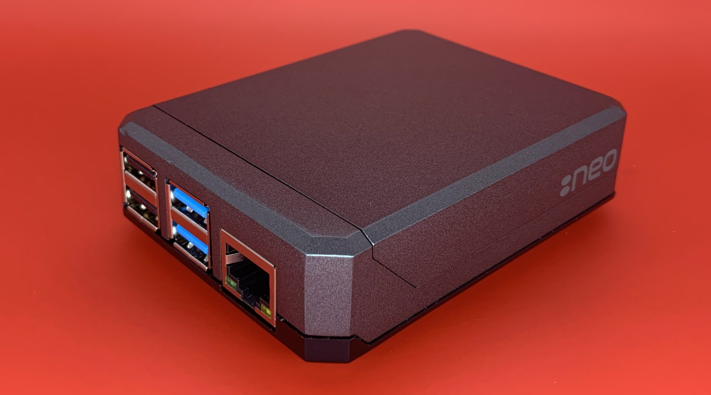
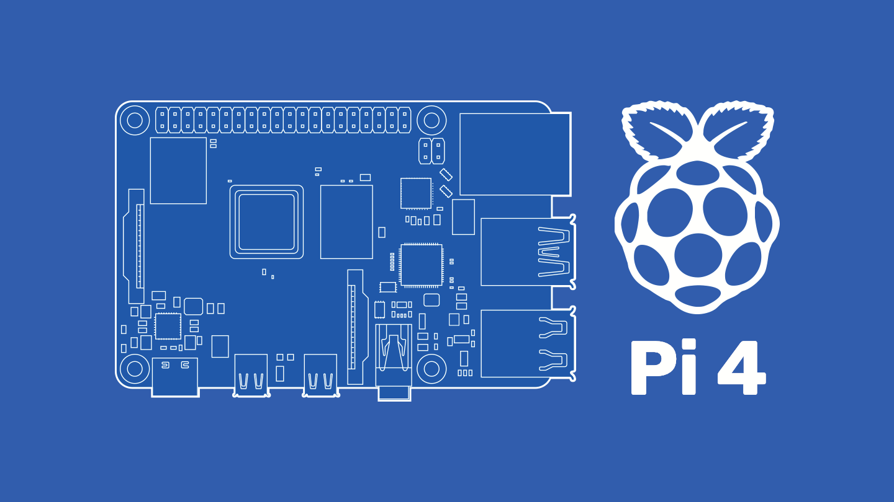

<!---->

#  Raspberry Pi 4 Model B 
Current Hobby-Build and DIY projects using a `Raspberry Pi 4 Model B (8GB RAM)`.

<br>



<br>

## Specs and Parts
```
Raspberry Pi 4 Model B (8GB LPDDR4-3200 RAM)
Raspbian: Raspberry Pi OS (32-bit)

32GB Micro SD Card

Argon NEO Case
Argon Fan Hat
Argon 18W 5V Power Supply w/ Switch
```

If you want more information about this Raspberry Pi 4 model, **[you can find it here](https://www.raspberrypi.com/products/raspberry-pi-4-model-b/)**.
<br>
Here are some other product links:
<br>
- **[Argon NEO Case](https://argon40.com/products/argon-neo-case-for-raspberry-pi-4)**
- **[Argon Fan Hat](https://argon40.com/products/argon-fan-hat?_pos=1&_sid=683d0d276&_ss=r)**
- **[Argon 18W 5V Power Supply](https://argon40.com/products/argon-type-c-power-supply-with-switch-18-watts-5-volts?_pos=3&_sid=4e581e253&_ss=r)**

<br>

# Getting Started
Here are the steps I took configure a brand new `Raspberry Pi 4 Model B`.

<br>

## **Raspberry Pi OS Image**
> My Raspberry Pi *did not* include a OS-boot Micro SD card. 
> I had to flash the OS Image to a new Micro SD card.

1. Download the `Raspberry Pi OS Imager` from **https://www.raspberrypi.com/software/**, or **[for Windows](https://downloads.raspberrypi.org/imager/imager_latest.exe)**.
2. Run the `Raspberry Pi OS Imager` installation.
3. Mount the **32GB Micro SD Card** onto your machine.
4. Open the `Raspberry Pi OS Imager`.
4. **OS:** choose `Raspbian: Raspberry Pi OS (32-bit) Debian Port w/ Raspberry Pi Desktop`.
5. **SD:** choose the mounted `32GB Micro SD Card`.
6. Now make any last minute **Advanced Settings** changes as necessary.
7. Select **Write** to flash the Micro SD Card with the OS Image *(may take a few minutes)*.

<br>

> Insert the Micro SD Card into the unpowered Raspberry Pi 4, for the first time.
> Proceed through the rest of the OS Installation on the Pi.

<br>

## **RPi Bash**
```
$ [sudo] apt-get update
$ [sudo] apt-get update && [sudo] apt-get upgrade
$ [sudo] apt full-upgrade
$ [sudo] reboot
```

<br>

## **Hostname**
```
$ [sudo] cat /etc/hosts
$ [sudo] nano /etc/hostname
$ [sudo] reboot
```
```
$ [sudo] nano /etc/hosts
$ [sudo] reboot
$ hostname
```
***(on /etc/hosts under 127.0.1.1)***

<br>

## **Argon Fan Hat Config**
```
$ curl https://download.argon40.com/argon1.sh | bash
$ [sudo] reboot
$ argonone-config
```
```
Fan Power Settings:
55°C=10%
60°C=55%
65°C=100%
```
<br>


## **SSH**
```
$ echo
```
<br>

## **Stressberry**
```
$ [sudo] apt install stress
$ pip3 install stressberry --user
$ pip3 install --upgrade numpy
```
```
$ mkdir ~/TemperatureTests
$ cd ~/TemperatureTests
```
```
$ /home/pi/.local/bin/stressberry-run -n "My Test" -d 1800 -i 300 -c 4 mytest.out
```
### *Resources:*
> **https://github.com/nschloe/stressberry**
> **https://core-electronics.com.au/guides/raspberry-pi/how-to-stress-test-temperature-on-raspberry-pi/**

## **Custom Scripts**

### **~/temperature.sh**
```
$ touch ~/temperature.sh
$ chmod +x ~/temperature.sh
$ nano ~/temperature.sh
$ cat ~/temperature.sh
$ ./temperature.sh
```

### **temp.py**
```
$ pip install gpiozero
$ python temp.py
```
