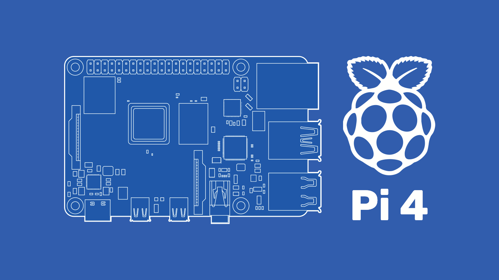

# Raspberry Pi (DIY Hobby Build)
My current DIY and Hobby-Build using a `Raspberry Pi 4 Model B (2GB RAM)`.
<br><br>

<br>
## Specs and Parts
```
Raspberry Pi 4 Model B (2GB RAM)
Raspberry Pi OS (32-bit)

32GB Micro SD Card

Argon NEO Case
Argon Fan Hat
Argon 18W 5V Power Supply w/ Switch
```
If you want more information about this Raspberry Pi model, **[you can find it here](https://www.raspberrypi.com/products/raspberry-pi-4-model-b/)**.
<br>
Here are some product links:
<br>
- **[Argon NEO Case](https://argon40.com/products/argon-neo-case-for-raspberry-pi-4)**
- **[Argon Fan Hat](https://argon40.com/products/argon-fan-hat?_pos=1&_sid=683d0d276&_ss=r)**
- **[Argon 18W 5V Power Supply](https://argon40.com/products/argon-type-c-power-supply-with-switch-18-watts-5-volts?_pos=3&_sid=4e581e253&_ss=r)**

## Getting Started
Here are the steps I took configure a brand new Raspberry Pi 4.

### Raspberry Pi OS Image
1. Purchase a **32GB Micro SD Card**, and flash it using the `Raspberry Pi OS Imager`.
2. Download the `Raspberry Pi OS Imager` from **https://www.raspberrypi.com/software/**, or **[for Windows](https://downloads.raspberrypi.org/imager/imager_latest.exe)**.
3. Install the `Raspberry Pi OS Imager` and run it.
4. **OS:** choose `Rasbian: Raspberry Pi OS (32-bit) Debian Port w/ Raspberry Pi Desktop`
5. **SD:** choose the mounted `32GB Micro SD Card`.
6. Now make any last minute **Advanced Settings** changes as necessary.
7. Write!
